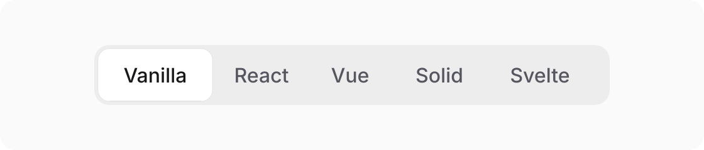

# Segmented Pill

Accessible segmented control for React and Vue. Static by default, with optional sliding motion.




**npm**

```sh
npm install segmented-pill
```

**pnpm**

```sh
pnpm add segmented-pill
```

**Bun**

```sh
bun add segmented-pill
```

## shadcn registry (React)

Add the hosted registry once:

```sh
npx shadcn@latest registry add @segmented-pill=https://segmented-pill.vercel.app/r/{name}.json
```

Then install the React wrapper:

```sh
npx shadcn@latest add @segmented-pill/segmented-pill
```

The wrapper installs `segmented-pill` and its stylesheet. npm remains the source of updates; the registry is an optional shadcn-friendly install path.

Geist is optional. If your app already loads it, Segmented Pill uses it automatically; otherwise it falls back to your system sans-serif font.

## React

```jsx
import { useState } from "react";
import { SegmentedPill } from "segmented-pill/react";
import "segmented-pill/style.css";

const items = [
  { value: "overview", label: "Overview" },
  { value: "activity", label: "Activity" },
  { value: "settings", label: "Settings" },
];

export function Navigation() {
  const [value, setValue] = useState("overview");

  return <>
    <SegmentedPill
      aria-label="Section"
      items={items}
      value={value}
      onValueChange={setValue}
      animated
    />

    {value === "overview" && <Overview />}
    {value === "activity" && <Activity />}
    {value === "settings" && <Settings />}
  </>;
}
```

## Vue

```vue
<script setup>
import { ref } from "vue";
import { SegmentedPill } from "segmented-pill/vue";
import "segmented-pill/style.css";

const value = ref("overview");
const items = [
  { value: "overview", label: "Overview" },
  { value: "activity", label: "Activity" },
  { value: "settings", label: "Settings" },
];
</script>

<template>
  <SegmentedPill
    v-model="value"
    aria-label="Section"
    :items="items"
    animated
  />

  <Overview v-if="value === 'overview'" />
  <Activity v-else-if="value === 'activity'" />
  <Settings v-else />
</template>
```

## API

| Purpose | React | Vue |
| --- | --- | --- |
| Options | `items` | `items` |
| Controlled value | `value` | `v-model` |
| Initial value | `defaultValue` | `defaultValue` |
| Change event | `onValueChange` | `change` |
| Sliding pill | `animated` | `animated` |

`animated` defaults to `false`. When enabled, the pill slides with a small stretch-and-squash response. Reduced-motion preferences always disable both effects.

Arrow keys, Home, End, Enter, and Space work automatically. Disabled items are skipped, focus stays visible, and ARIA selection state remains synchronized. Add `aria-label` or `aria-labelledby` to every control.

## Theme

```css
.my-control {
  --segmented-font-family: "Geist", "Geist Variable", sans-serif;
  --segmented-track: #e9e3db;
  --segmented-pill: #fffdf9;
  --segmented-focus: #8a5a32;
  --segmented-radius: 12px;
}
```

MIT
